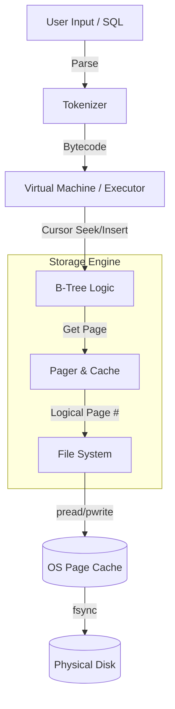

# P1-DB-Engine
C-based implementation of a B-Tree indexing system for file I/O optimization. Focuses on low-level memory management and persistent data structure design.
SQLite 아키텍처를 기반으로 구현한 경량화된 데이터베이스 엔진입니다. 
Let's build a simple database 튜토리얼을 참고하였습니다. 
B-Tree 기반의 디스크 페이징 시스템을 구현하여 대용량 데이터 처리의 기반을 마련했습니다.

## Key Features 

1. Atomic I/O Operations (lseek vs pread/pwrite)
튜토리얼 방식: lseek()으로 오프셋을 이동시킨 후 read()/write()를 호출하는 방식.

문제점: 차후 구현할 멀티스레드 환경에서 lseek과 write 사이에 Context Switch가 발생하면, 다른 스레드가 오프셋을 변경하여 데이터가 엉뚱한 곳에 덮어씌워지는 Race Condition 발생.

나의 구현: pread() / pwrite() 도입.

개선점: 파일 오프셋 변경과 읽기/쓰기가 Atomic하게 수행됨을 보장. 별도의 파일 락 없이도 I/O 레벨의 Thread-safety 확보 기반 마련.

2. ACID Durability Guarantee (fsync)
튜토리얼 방식: write()만 호출하고 종료.

문제점: 데이터가 물리 디스크가 아닌 OS의 Page Cache(RAM)에만 머물러 있음. 전원 차단 시 데이터 유실 가능성 100%.

나의 구현: 페이지 플러시(Flush) 직후 fsync() 강제 호출.

개선점: Dirty Page가 물리적 디스크에 완전히 기록됨을 커널단에서 보장하여 ACID의 Durability 속성 충족.

3. B-Tree Node Layout (4KB Page)
데이터 검색 속도를 O(N)에서 O(log N)으로 단축하기 위해 B-Tree 자료구조를 파일 시스템 위에 매핑.

Internal Node: 자식 페이지를 가리키는 포인터와 Key(Router) 저장.

Leaf Node: 실제 직렬화된 Row 데이터 저장.

Root Split Trick: 루트 노드가 꽉 찰 경우, 데이터를 새 페이지로 복사하고 Root Page Number(0번)를 유지하는 기법을 사용하여 진입점(Entry Point)의 불변성 유지.

## Performance & Specs
Page Size: 4KB (OS 가상 메모리 페이지 크기와 일치시켜 I/O 효율 최적화)

Max Pages: 400 Pages (Configurable)

Supported Operations: INSERT, SELECT (Full Table Scan & Key Lookup)

Durability: Write-Through (via fsync)

## Performance Benchmark

Python 스크립트를 통해 1,000건의 트랜잭션을 수행하며, Durability 설정에 따른 성능 차이를 비교 분석.

### Comparative Analysis
| Mode | Throughput (TPS) | Latency (Total) | Description |
| :--- | :--- | :--- | :--- |
| Unsafe (No fsync) | 291,493 TPS | 0.003s | OS Page Cache에만 기록. 속도는 빠르나 전원 장애 시 데이터 유실 위험 있음. |
| Safe (fsync) | 2,848 TPS | 0.35s | ACID Durability 보장. 매 트랜잭션마다 물리 디스크 동기화 수행. |

###  Engineering Insight
- The Cost of Durability: 데이터의 영속성(Persistence)을 보장하기 위해 약 100배의 성능 비용이 발생함을 확인함.
- Engine Efficiency: `fsync`를 제거했을 때 약 29만 TPS가 나오는 것을 통해, B-Tree 탐색 및 분할(Split) 알고리즘 자체의 오버헤드는 매우 낮게 최적화되어 있음을 입증.
- Optimization Strategy: 현재는 안정성을 최우선으로 `fsync`를 적용했으나, 추후 WAL(Write-Ahead Logging)  패턴을 도입하여 안전성과 속도 사이의 균형을 맞출 계획.

- Environment: Intel Core i7-12700H (14 Cores / 20 Threads)

fsync 방식일 때

- Total Time: 0.3406s
- Throughput: ~2935.73 TPS

fsync 방식이 아닐 때

- Total Time: 0.0034s
- Throughput: ~291493.78 TPS

## Architecture 

## Future Roadmap (Post-Assignment)
Concurrency Control: Pager에 Mutex를 도입하여 멀티스레드 지원.

Buffer Pool Manager: OS 캐시에 의존하지 않는 사용자 레벨의 LRU 캐시 구현.

Network Layer: 소켓 프로그래밍을 통한 Client-Server 아키텍처 확장. 
